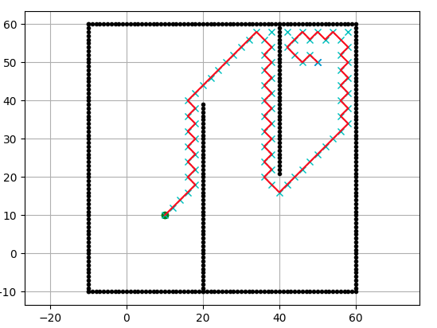

# Nav2-DFS-Planner

* author :  duyongquan
* e-mail: quandy2020@126.com

## 知识前提

1. 二叉树遍历
2. 图的DFS遍历

## 二叉树遍历

* 四种主要的遍历思想为：

  * 前序遍历：根结点 ---> 左子树 ---> 右子树

  * 中序遍历：左子树---> 根结点 ---> 右子树

  * 后序遍历：左子树 ---> 右子树 ---> 根结点

  * 层次遍历：只需按层次遍历即可

  <table style="width:100%">
    <tr>
      <th>
        <p align="center">
             
             <br>前序遍历
        </p>
      </th>
          <th><p align="center">
             
             <br>中序遍历
          </p>
      </th>
         <th><p align="center">
             
             <br>后序遍历
          </p>
      </th>
          <th><p align="center">
             
             <br>层次遍历
          </p>
      </th>
  </table>

* 深度优先遍历
* 广度优先遍历(层次遍历)

## 图的DFS遍历

**深度优先遍历是一种优先走到底、无路可走再回头的遍历方式**。具体地，从某个顶点出发，访问当前顶点的某个邻接顶点，直到走到尽头时返回，再继续走到尽头并返回，以此类推，直至所有顶点遍历完成。

    

## DFS-Planner



Python Code

```python
import math

import matplotlib.pyplot as plt

show_animation = True


class DepthFirstSearchPlanner:

    def __init__(self, ox, oy, reso, rr):
        """
        Initialize grid map for Depth-First planning

        ox: x position list of Obstacles [m]
        oy: y position list of Obstacles [m]
        resolution: grid resolution [m]
        rr: robot radius[m]
        """

        self.reso = reso
        self.rr = rr
        self.calc_obstacle_map(ox, oy)
        self.motion = self.get_motion_model()

    class Node:
        def __init__(self, x, y, cost, parent_index, parent):
            self.x = x  # index of grid
            self.y = y  # index of grid
            self.cost = cost
            self.parent_index = parent_index
            self.parent = parent

        def __str__(self):
            return str(self.x) + "," + str(self.y) + "," + str(
                self.cost) + "," + str(self.parent_index)

    def planning(self, sx, sy, gx, gy):
        """
        Depth First search

        input:
            s_x: start x position [m]
            s_y: start y position [m]
            gx: goal x position [m]
            gy: goal y position [m]

        output:
            rx: x position list of the final path
            ry: y position list of the final path
        """

        nstart = self.Node(self.calc_xyindex(sx, self.minx),
                           self.calc_xyindex(sy, self.miny), 0.0, -1, None)
        ngoal = self.Node(self.calc_xyindex(gx, self.minx),
                          self.calc_xyindex(gy, self.miny), 0.0, -1, None)

        open_set, closed_set = dict(), dict()
        open_set[self.calc_grid_index(nstart)] = nstart

        while True:
            if len(open_set) == 0:
                print("Open set is empty..")
                break

            current = open_set.pop(list(open_set.keys())[-1])
            c_id = self.calc_grid_index(current)

            # show graph
            if show_animation:  # pragma: no cover
                plt.plot(self.calc_grid_position(current.x, self.minx),
                         self.calc_grid_position(current.y, self.miny), "xc")
                # for stopping simulation with the esc key.
                plt.gcf().canvas.mpl_connect('key_release_event',
                                             lambda event:
                                             [exit(0) if event.key == 'escape'
                                              else None])
                plt.pause(0.01)

            if current.x == ngoal.x and current.y == ngoal.y:
                print("Find goal")
                ngoal.parent_index = current.parent_index
                ngoal.cost = current.cost
                break

            # expand_grid search grid based on motion model
            for i, _ in enumerate(self.motion):
                node = self.Node(current.x + self.motion[i][0],
                                 current.y + self.motion[i][1],
                                 current.cost + self.motion[i][2], c_id, None)
                n_id = self.calc_grid_index(node)

                # If the node is not safe, do nothing
                if not self.verify_node(node):
                    continue

                if n_id not in closed_set:
                    open_set[n_id] = node
                    closed_set[n_id] = node
                    node.parent = current

        rx, ry = self.calc_final_path(ngoal, closed_set)
        return rx, ry

    def calc_final_path(self, ngoal, closedset):
        # generate final course
        rx, ry = [self.calc_grid_position(ngoal.x, self.minx)], [
            self.calc_grid_position(ngoal.y, self.miny)]
        n = closedset[ngoal.parent_index]
        while n is not None:
            rx.append(self.calc_grid_position(n.x, self.minx))
            ry.append(self.calc_grid_position(n.y, self.miny))
            n = n.parent

        return rx, ry

    def calc_grid_position(self, index, minp):
        """
        calc grid position

        :param index:
        :param minp:
        :return:
        """
        pos = index * self.reso + minp
        return pos

    def calc_xyindex(self, position, min_pos):
        return round((position - min_pos) / self.reso)

    def calc_grid_index(self, node):
        return (node.y - self.miny) * self.xwidth + (node.x - self.minx)

    def verify_node(self, node):
        px = self.calc_grid_position(node.x, self.minx)
        py = self.calc_grid_position(node.y, self.miny)

        if px < self.minx:
            return False
        elif py < self.miny:
            return False
        elif px >= self.maxx:
            return False
        elif py >= self.maxy:
            return False

        # collision check
        if self.obmap[node.x][node.y]:
            return False

        return True

    def calc_obstacle_map(self, ox, oy):

        self.minx = round(min(ox))
        self.miny = round(min(oy))
        self.maxx = round(max(ox))
        self.maxy = round(max(oy))
        print("min_x:", self.minx)
        print("min_y:", self.miny)
        print("max_x:", self.maxx)
        print("max_y:", self.maxy)

        self.xwidth = round((self.maxx - self.minx) / self.reso)
        self.ywidth = round((self.maxy - self.miny) / self.reso)
        print("x_width:", self.xwidth)
        print("y_width:", self.ywidth)

        # obstacle map generation
        self.obmap = [[False for _ in range(self.ywidth)]
                      for _ in range(self.xwidth)]
        for ix in range(self.xwidth):
            x = self.calc_grid_position(ix, self.minx)
            for iy in range(self.ywidth):
                y = self.calc_grid_position(iy, self.miny)
                for iox, ioy in zip(ox, oy):
                    d = math.hypot(iox - x, ioy - y)
                    if d <= self.rr:
                        self.obmap[ix][iy] = True
                        break

    @staticmethod
    def get_motion_model():
        # dx, dy, cost
        motion = [[1, 0, 1],
                  [0, 1, 1],
                  [-1, 0, 1],
                  [0, -1, 1],
                  [-1, -1, math.sqrt(2)],
                  [-1, 1, math.sqrt(2)],
                  [1, -1, math.sqrt(2)],
                  [1, 1, math.sqrt(2)]]

        return motion


def main():
    print(__file__ + " start!!")

    # start and goal position
    sx = 10.0  # [m]
    sy = 10.0  # [m]
    gx = 50.0  # [m]
    gy = 50.0  # [m]
    grid_size = 2.0  # [m]
    robot_radius = 1.0  # [m]

    # set obstacle positions
    ox, oy = [], []
    for i in range(-10, 60):
        ox.append(i)
        oy.append(-10.0)
    for i in range(-10, 60):
        ox.append(60.0)
        oy.append(i)
    for i in range(-10, 61):
        ox.append(i)
        oy.append(60.0)
    for i in range(-10, 61):
        ox.append(-10.0)
        oy.append(i)
    for i in range(-10, 40):
        ox.append(20.0)
        oy.append(i)
    for i in range(0, 40):
        ox.append(40.0)
        oy.append(60.0 - i)

    if show_animation:  # pragma: no cover
        plt.plot(ox, oy, ".k")
        plt.plot(sx, sy, "og")
        plt.plot(gx, gy, "xb")
        plt.grid(True)
        plt.axis("equal")

    dfs = DepthFirstSearchPlanner(ox, oy, grid_size, robot_radius)
    rx, ry = dfs.planning(sx, sy, gx, gy)

    if show_animation:  # pragma: no cover
        plt.plot(rx, ry, "-r")
        plt.pause(0.01)
        plt.show()


if __name__ == '__main__':
    main()
```


