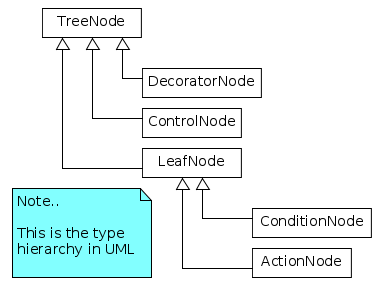
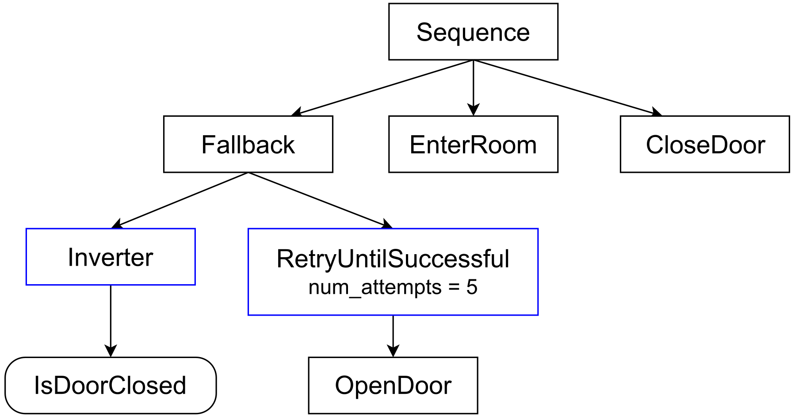
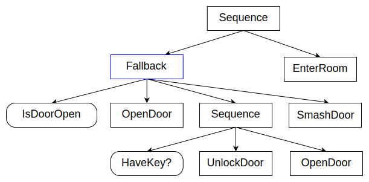

<center> <font size=10 color=green> Behavior Tree</font></font></center>

# 1 介绍

## 1.1 github

* github.com/BehaviorTree

```shell
https://github.com/BehaviorTree/BehaviorTree.CPP.git
```

* Groot

```shell
https://github.com/BehaviorTree/Groot.git
```


## 1.2 关于

* **C++** library  framework
*  replace Finite State Machines


## 1.3 特点features

* It makes **asynchronous Actions**, i.e. non-blocking routines, a first-class citizen.
* Trees are created at run-time, using an **interpreted language** (based on XML).
* It includes a **logging/profiling** infrastructure that allows the user to visualize, record, replay and analyze state transitions.
* You can link statically your custom TreeNodes or convert them into plugins which are loaded at run-time.


## 1.4 What is a Behavior Tree?

* BTs are a very efficient way of creating complex systems that are both modular and reactive.
* If you are already familiar with Finite State Machines (**FSM**), you will easily grasp most of the concepts but, hopefully, you will find that BTs are more expressive and easier to reason about.
* "composable": in other words, they can be "assembled" to build behaviors.


## 1.5 Main Advantages of Behavior Trees

* **They are intrinsically hierarchical**: we can *compose* complex behaviors, including entire trees as sub-branches of a bigger tree. For instance, the behavior "Fetch Beer" may reuse the tree "Grasp Object".

* **Their graphical representation has a semantic meaning**: it is easier to "read" a BT and understand the corresponding workflow. State transitions in FSMs, by comparisons, are harder to understand both in their textual and graphical representation.
* **They are more expressive**: Ready to use ControlNodes and DecoratorNodes make it possible to express more complex control flows. The user can extend the "vocabulary" with his/her own custom nodes.


## 1.6 WHY do we need BehaviorTrees (or FSM)?

A "good" software architecture should have the following characteristics:

- Modularity.
- Reusability of components.
- Composability.
- Good separation of concerns.


# 2 基本概念

## 2.1 BT简介

### 1 Basic Concepts

- A signal called "**tick**" is sent to the root of the tree and propagates through the tree until it reaches a leaf node.
- Any TreeNode that receives a **tick** signal executes its callback. This callback must return either
  - **SUCCESS**
  - **FAILURE**
  - **RUNNING**
- RUNNING means that the action needs more time to return a valid result.
- If a TreeNode has one or more children, it is its responsibility to propagate the tick; each Node type may have different rules about if, when and how many times children are ticked.
- The **LeafNodes**, those TreeNodes which don't have any children, are the actual commands, i.e. the Nodes where the behavior tree interacts with the rest of the system. **Actions** nodes are the most common type of LeafNodes.

### 2 How tick works

To mentally visualize how ticking the tree works, consider the example below.

A **Sequence** is the simplest **ControlNode**: it executes its children one after the other and, if they all Succeed, it returns SUCCESS too.

1. The first tick sets the Sequence node to RUNNING (orange).
2. Sequence tick the first child, "OpenDoor", that eventually returns SUCCESS.
3. As a result, the second child "Walk" and later "CloseDoor" are ticked.
4. Once the last child is completed, the entire Sequence switches from RUNNING to SUCCESS.


### 3 Types of nodes




### 4  Sequence


### 5 Decorators



### 6 Fallback





### 7 **GrabBeer**


## 2.2 主要概念

### 1 Nodes vs Trees


### 2 The tick() callbacks

```c++
// The simplest callback you can wrap into a BT Action
NodeStatus HelloTick()
{
  std::cout << "Hello World\n"; 
  return NodeStatus::SUCCESS;
}

// Allow the library to create Actions that invoke HelloTick()
// (explained in the tutorials)
factory.registerSimpleAction("Hello", std::bind(HelloTick));
```


### 3 Create custom nodes with inheritance

In the example above, a specific type of TreeNodes which invoke `HelloTick` was created using a **function pointer** (dependency injection).

More generally, to define a custom TreeNode, you should inherit from the class `TreeNode` or, more specifically, its derived classes:

- `ActionNodeBase`
- `ConditionNode`
- `DecoratorNode`


### 4 Dataflow, Ports and Blackboard

For the time being, it is important to know that:

- A **Blackboard** is a *key/value* storage shared by all the Nodes of a Tree.

- **Ports** are a mechanism that Nodes can use to exchange information between each other.

- Ports are *"connected"* using the same *key* of the blackboard.

- The number, name and kind of ports of a Node must be known at *compilation-time* (C++); connections between ports are done at *deployment-time* (XML).

- You can store as value any C++ type (we use a _*type erasure* technique similar to [std::any](https://www.fluentcpp.com/2021/02/05/how-stdany-works/)).

  

## 2.3 XML语法

```xml
 <root BTCPP_format="4">
     <BehaviorTree ID="MainTree">
        <Sequence name="root_sequence">
            <SaySomething   name="action_hello" message="Hello"/>
            <OpenGripper    name="open_gripper"/>
            <ApproachObject name="approach_object"/>
            <CloseGripper   name="close_gripper"/>
        </Sequence>
     </BehaviorTree>
 </root>
```


- The first tag of the tree is `<root>`. It should contain **1 or more** tags `<BehaviorTree>`.
- The tag `<BehaviorTree>` should have the attribute `[ID]`.
- The tag `<root>` should contain the attribute `[BTCPP_format]`.
- Each TreeNode is represented by a single tag. In particular:
  - The name of the tag is the **ID** used to register the TreeNode in the factory.
  - The attribute `[name]` refers to the name of the instance and is **optional**.
  - Ports are configured using attributes. In the previous example, the action `SaySomething` requires the input port `message`.
- In terms of number of children:
  - `ControlNodes` contain **1 to N children**.
  - `DecoratorNodes` and Subtrees contain **only 1 child**.
  - `ActionNodes` and `ConditionNodes` have **no child**.

### 1 Ports Remapping and pointers to Blackboards entries

As explained in the [second tutorial](https://www.behaviortree.dev/docs/tutorial-basics/tutorial_02_basic_ports) input/output ports can be remapped using the name of an entry in the Blackboard, in other words, the **key** of a **key/value** pair of the BB.

An BB key is represented using this syntax: `{key_name}`.

In the following example:

- the first child of the Sequence prints "Hello",
- the second child reads and writes the value contained in the entry of the blackboard called "my_message";

```XML
 <root BTCPP_format="4" >
     <BehaviorTree ID="MainTree">
        <Sequence name="root_sequence">
            <SaySomething message="Hello"/>
            <SaySomething message="{my_message}"/>
        </Sequence>
     </BehaviorTree>
 </root>
```

### 2 Compact vs Explicit representation

The following two syntaxes are both valid:

```XML
 <SaySomething               name="action_hello" message="Hello World"/>
 <Action ID="SaySomething"   name="action_hello" message="Hello World"/>
```


We will call the former syntax "**compact**" and the latter "**explicit**". The first example represented with the explicit syntax would become:

```XML
 <root BTCPP_format="4" >
     <BehaviorTree ID="MainTree">
        <Sequence name="root_sequence">
           <Action ID="SaySomething"   name="action_hello" message="Hello"/>
           <Action ID="OpenGripper"    name="open_gripper"/>
           <Action ID="ApproachObject" name="approach_object"/>
           <Action ID="CloseGripper"   name="close_gripper"/>
        </Sequence>
     </BehaviorTree>
 </root>
```


Even if the compact syntax is more convenient and easier to write, it provides too little information about the model of the TreeNode. Tools like **Groot** require either the *explicit* syntax or additional information. This information can be added using the tag `<TreeNodeModel>`.

To make the compact version of our tree compatible with Groot, the XML must be modified as follows:

```XML
 <root BTCPP_format="4" >
     <BehaviorTree ID="MainTree">
        <Sequence name="root_sequence">
           <SaySomething   name="action_hello" message="Hello"/>
           <OpenGripper    name="open_gripper"/>
           <ApproachObject name="approach_object"/>
           <CloseGripper   name="close_gripper"/>
        </Sequence>
    </BehaviorTree>
    
    <!-- the BT executor don't require this, but Groot does -->     
    <TreeNodeModel>
        <Action ID="SaySomething">
            <input_port name="message" type="std::string" />
        </Action>
        <Action ID="OpenGripper"/>
        <Action ID="ApproachObject"/>
        <Action ID="CloseGripper"/>      
    </TreeNodeModel>
 </root>
```

### 3 Subtrees

As we saw in [this tutorial](https://www.behaviortree.dev/docs/tutorial-basics/tutorial_06_subtree_ports), it is possible to include a Subtree inside another tree to avoid "copy and pasting" the same tree in multiple location and to reduce complexity.

Let's say that we want to incapsulate few action into the behaviorTree "**GraspObject**" (being optional, attributes [name] are omitted for simplicity).

```XML
 <root BTCPP_format="4" >
 
     <BehaviorTree ID="MainTree">
        <Sequence>
           <Action  ID="SaySomething"  message="Hello World"/>
           <SubTree ID="GraspObject"/>
        </Sequence>
     </BehaviorTree>
     
     <BehaviorTree ID="GraspObject">
        <Sequence>
           <Action ID="OpenGripper"/>
           <Action ID="ApproachObject"/>
           <Action ID="CloseGripper"/>
        </Sequence>
     </BehaviorTree>  
 </root>
```


We may notice as the entire tree "GraspObject" is executed after "SaySomething".


### 4 Include external files

**Since version 2.4**.

You can include external files in a way that is similar to '**#include \<file>**' in C++. We can do this easily using the tag:

```XML
  <include path="relative_or_absolute_path_to_file">
```


using the previous example, we may split the two behavior trees into two files:

```XML
 <!-- file maintree.xml -->

 <root BTCPP_format="4" >
     
     <include path="grasp.xml"/>
     
     <BehaviorTree ID="MainTree">
        <Sequence>
           <Action  ID="SaySomething"  message="Hello World"/>
           <SubTree ID="GraspObject"/>
        </Sequence>
     </BehaviorTree>
  </root>
```


```XML
 <!-- file grasp.xml -->

 <root BTCPP_format="4" >
     <BehaviorTree ID="GraspObject">
        <Sequence>
           <Action ID="OpenGripper"/>
           <Action ID="ApproachObject"/>
           <Action ID="CloseGripper"/>
        </Sequence>
     </BehaviorTree>  
 </root>
```


NOTE

Note "Note for ROS users" If you want to find a file inside a [ROS package](http://wiki.ros.org/Packages), you can use this syntax:

```XML
<include ros_pkg="name_package"  path="path_relative_to_pkg/grasp.xml"/>
```